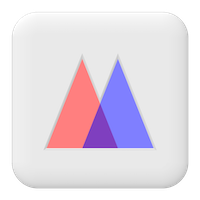

# <br>Upgrading to 2.0

Version 2.0 is a major release. Most code will upgrade without changes, but
there are some breaking changes that you should check your code against before
upgrading.

## `contains()` No Longer Accepts a Callback
**Check this one first. Code that is not updated will not error; it will simply
return `false`.**

In 1.x, `contains()` would accept either a value to look for, or a callback to
search with. It now only ever looks for a value, and searching with a callback
has moved to the new `any()` method:
```php
// 1.x
$collection->contains(fn ($user) => $user->isAdmin());

// 2.0
$collection->any(fn ($user) => $user->isAdmin());
```
Any callable that you pass to `contains()`, including closures, invokable
objects and `[$object, 'method']` arrays, is now treated as a value to look for,
so you can now safely check whether a collection of callables contains a
particular one.

Search your code for `->contains(` and change any call that passes a callback
to use `any()` instead.

## Requirements
PHP 8.2 or later is now required. PHP 8.0 and 8.1 are no longer supported. PHP
8.2 up to and including 8.6 are supported.

## Collections No Longer Extend `ArrayObject`
`Collection` now stores its items in a plain PHP array rather than extending
`ArrayObject`. This makes nearly every method faster, and `pop()` dramatically
so, but it does mean that:

- `$collection instanceof ArrayObject` is now `false`. If you type hint against
`ArrayObject`, switch to `Collection`, or to one of the interfaces that it
implements: `ArrayAccess`, `Countable`, `IteratorAggregate` or
`JsonSerializable`.
- Methods that only existed on `ArrayObject` are gone. These include `ksort()`,
`uksort()`, `natsort()`, `natcasesort()`, `setFlags()`, `getFlags()`,
`setIteratorClass()` and `getIteratorClass()`. The `append()`, `offsetExists()`,
`offsetGet()`, `offsetSet()`, `offsetUnset()`, `count()`, `getIterator()`,
`getArrayCopy()` and `exchangeArray()` methods remain.
- Casting a collection to an array with `(array)$collection` no longer returns
its items. Use `$collection->getArrayCopy()` instead.
- Modifying a nested value in place, such as `$collection['key'][] = $value`, no
longer has any effect, and PHP will raise an _"Indirect modification of
overloaded element"_ notice. Previously this bypassed any key and value type
restrictions. Read the value out, modify it, and set it back instead.
- Iterating by reference, such as `foreach ($collection as &$value)`, no longer
modifies the collection. The loop runs over a copy of the items, so any changes
are silently discarded. Use `map()` to get a modified copy, or set each value
back with `$collection[$key] = $value`. For the same reason, items that you add
or remove inside a `foreach` loop are not seen by that loop.
- Collections serialized with 1.x (for example, stored in a cache or session)
cannot be unserialized by 2.0. They will come back empty, and PHP will raise
_"Creation of dynamic property"_ deprecation notices. Clear any stored
collections when you upgrade.
- Calling `offsetExists()` directly for a key that holds `null` now returns
`false`, the same as `isset()`. `isset()` and `empty()` behave as before.
- `exchangeArray()` now enforces your collection's key and value types, and
applies your key strategy, just as the constructor does.

## Sorting
`asort()` and `uasort()` still return a sorted copy of the collection, as they
did in 1.x. They are no longer overrides of the `ArrayObject` methods of the
same name, so they will continue to work under PHP 9.

## Functional Methods No Longer Call Your Constructor
`map()`, `filter()`, `slice()`, `sort()`, `usort()`, `asort()`, `uasort()` and
`shuffle()` all return a new collection of the same type. These new collections
are now created by cloning the original collection and then replacing its
items, rather than by calling `new static($items)`.

Key strategies and key and value types are still applied to every item. If your
own collection class does additional work in its constructor, that work will no
longer happen for these new collections, and any other properties on your class
will be copied across from the original.

## Behaviour Changes
- `last()` with a callback now returns the last _item_ that the callback
matches. Previously it returned the callback's return value, usually `true`,
and threw a `TypeError` on collections with a restricted value type.
- `first()` with a callback no longer skips empty values before calling your
callback, so `$collection->first(fn ($value) => $value === 0)` will now find
`0`. Without a callback, `first()` and `last()` still return the first and last
non-empty values.
- `shuffle()` with a seed no longer reseeds PHP's global random number
generator, so it will no longer affect later calls to `mt_rand()` or
`shuffle()`. The shuffled order for any given seed is unchanged.
- `collectInto()` now throws a `TypeError` if the class does not exist or is not
a `Collection`, just like `Collection::newCollectionOfType()`.

## Method Signatures
Some parameters have gained native types:

- `implode(string $glue = '', ?callable $callable = null)`
- `push(mixed ...$vals)`
- `newCollectionOfType(string $type, mixed $items = [])`
- `exchangeArray(mixed $items)`

Overrides in your own collection classes that leave these parameters untyped
will continue to work. However, if you override `exchangeArray()` with the
`array|object $array` signature from `ArrayObject`, you will need to change it
to `mixed $items`.

## Static Analysis
Collections now carry generic types for static analysis tools such as PHPStan
and Psalm. If you run these tools at a strict level, you may be asked to state
the key and value types of your own collections:
```php
/**
 * @extends Collection<int, User>
 */
class UserCollection extends Collection
{
    protected ?string $valueType = User::class;
}
```
